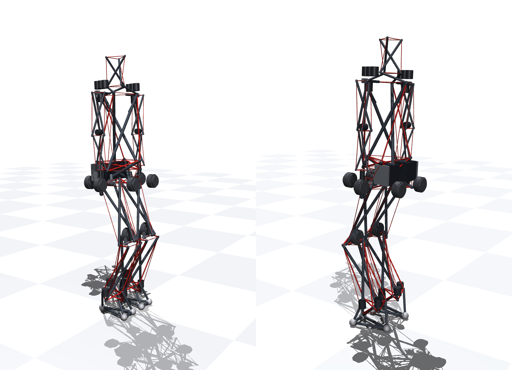
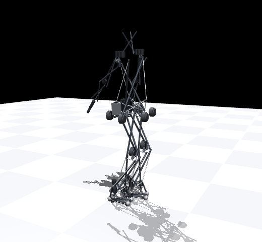
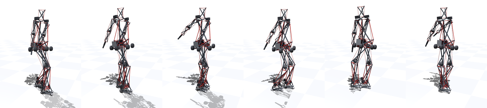
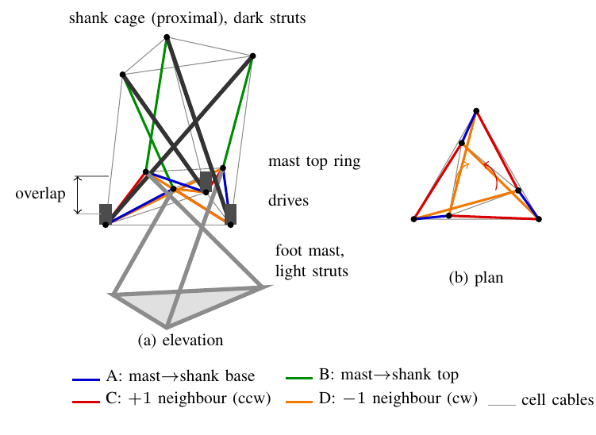
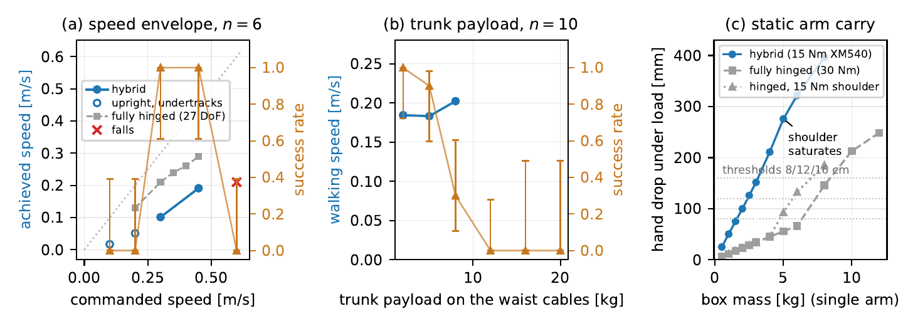

# Hybrid Tensegrity Humanoid

**MPC-in-the-loop design evaluation of a full-size humanoid built from tensegrity
structure.** MuJoCo models, an MJPC (iLQG) walking controller, and the experiment
suite behind the paper *MPC-in-the-Loop Design Evaluation of a Hybrid Tensegrity
Humanoid* (under review; PDF in [`paper/`](paper/codesign_paper.pdf)).

<p align="center">
  
  
</p>

## The question

Which joints of a tensegrity humanoid must remain conventional bearings for the
robot to be controllable, and what does each bearing cost in mass and buy in
control? Three simulated machines of identical anthropometry are compared under
receding-horizon iLQG:

| machine | joints | outcome |
|---|---|---|
| **pure tensegrity** | none; 210 free DoF, 306 cables | stands when anchored; no planner attempted (tractability, not controllability: every counter-wound joint has a strict self-stress, *t*₆ > 0) |
| **fully hinged** (27 DoF, tendon-driven) | bearing at every joint | walks (7/10 at 0.21 m/s), but its cable network *raises* passive impact loads (+14 % at 0.1 m) and its cable transmission is short of torque at 13 of 27 DoF mid-stride |
| **hybrid** (this design) | bearings at hips and knees; tensegrity joints at ankles and waist | **walks 10/10 at 0.20 m/s at the specified series-elastic cable stiffness**, 20.1 kg at 1.68 m, 0.8 kg of articulation hardware |

The allocation rule that follows: **bearings where the gait's torque requirements
concentrate, series-elastic cable interfaces where impacts enter the structure.**

## Key results

<p align="center">
  
</p>

**Mass.** 20.1 kg at 1.68 m (11.9 kg/m), against 30–80 kg for built humanoids of
similar stature. Every member is sized from simulated load traces: 60 CFRP tubes
at the minimum manufacturable wall (manufacturability-, not load-limited),
12-strand UHMWPE tendons, AK70-class hip/knee drives through ~3:1 tendon loops,
XM540-class tension drives at ankles and waist.

**The bearing-free joint.** The foot's three-strut mast overlaps 0.2 *H* into the
shank cage; twelve cables in four families join them. Overlap gives force closure,
but only a *counter-wound* pair of cross families gives the strict self-stress
(*t*₆ > 0) that tension-only actuators need to reject disturbances. At the
specified 40 kN/m series-elastic stiffness the joint attenuates drop impacts by
27–32 % against a mass-matched pin joint; at 400 kN/m (bare rope) the effect
inverts.

<p align="center">
  
</p>

**Walking across the specified stiffness range** (same controller, no retuning):

| interface cables | planner / plant step | walks | upright 16 s | speed | real time |
|---|---|---|---|---|---|
| 2.4 kN/m (development configuration) | 8 / 4 ms | 10/10 | 10/10 | 0.19 m/s | 0.29× |
| 20 kN/m | 2 / 1 ms | 9/10 | 8/10 | 0.19 m/s | 0.062× |
| **40 kN/m (design point)** | 1 / 0.5 ms | **10/10** | 10/10 | **0.20 m/s** | 0.034× |
| 168 kN/m | 0.82 / 0.41 ms | 5/5 | 5/5 | 0.12 m/s | 0.030× |

The 2.4 kN/m development configuration was chosen for the planner, not the
hardware: it is the stiffest cable the 8 ms planner step integrates stably and it
plans ~8× faster, which made the several hundred tuning runs tractable. Stiffer
cables need proportionally smaller steps (MJPC's 512-knot horizon cap sets the
0.82 ms floor at 168 kN/m).

**Robustness and drives (40 kN/m design point unless noted).** Ten Monte Carlo
trials at 20 kN/m with cable stiffness ±30 %, prestress ±20 %, body masses ±15 %
and ground friction μ ∈ [0.3, 0.9] walk 10/10 (lowest μ walked: 0.32). Over 120 s
of logged walking, leg-torque commands exceed the 74 N·m drive peak in two
isolated episodes of ≤ 1.5 ms; RMS demand is 5.3 N·m motor-side, 67 % of the
AK70-10 rating.

**Capability envelope** (development configuration; 40 kN/m results in the paper):

<p align="center">
  
</p>

Reliable speed band 0.30–0.45 m/s command (0.10–0.19 m/s achieved; 0.23 m/s after
retuning stride and clearance); trunk payload 10/10 at 2 kg, 0/10 at 12 kg on the
tensegrity waist (a 4 cm forward placement restores 10 kg at 10/10); single-arm
carry 2 kg at soft cables, 4 kg at 40 kN/m, where the hybrid becomes motor-limited
like the hinged machine.

**Joint-count study.** Rigidizing the hybrid's tensegrity joints raises speed
monotonically (0.19 → 0.21 → 0.23 m/s) and removes compliance; the gait tuned for
the compliant waist fails outright (0/5) when that joint is rigidized until one
parameter is retuned. Removing the bearings removes planner tractability.

## Repository layout

- `mujoco/` — parametric model generators (`generate_hybrid_humanoid.py` builds
  the hybrid from one node-geometry description; the pure and hinged variants have
  their own generators) and compiled XML models.
- `experiments/` — every experiment in the paper, one script each:
  - `hybrid_baseline_verify.py` — development-configuration baseline and controls
  - `e27_walker_stiffness.py` — the walker at 20/40/168 kN/m (design point)
  - `e28_stiff_sweeps.py` — payload and Monte Carlo robustness at stiff cables
  - `e10`/`e19` — bearing-free joint testbed: closure, drops, stiffness sweep
  - `e15`, `e26` — cable-family search, counter-wound chain
  - `e17`, `e20` — joint-count study and rigid-waist retune
  - `e1`–`e9`, `e11` — the fully hinged E-suite (impact, stiffness, degradation,
    proximal mass, tendon realisability, authority audit)
  - `make_numbers.py` — regenerates `paper/numbers.tex` (every number in the
    paper) from the results JSONs; `plot_hybrid_sweeps.py` regenerates Fig. 4.
  Outputs land in `experiments/results/` (gitignored, ~4 GB, regenerable).
- `paper/` — LaTeX source, figures, video attachment.
- `design/`, `references/` — design notes and bibliography.
- `HYBRID_WALKER.md` — working notes on the hybrid walker.

## Reproducing

```sh
python -m venv .venv && .venv/bin/pip install mujoco numpy scipy matplotlib
.venv/bin/python mujoco/generate_hybrid_humanoid.py        # model
.venv/bin/python experiments/e27_walker_stiffness.py run 40 10   # design-point walker, n=10
.venv/bin/python experiments/make_numbers.py               # paper/numbers.tex
cd paper && latexmk -pdf codesign_paper.tex
```

Walking experiments drive MJPC's headless `testspeed` runner and need the
`mujoco_mpc` build below. At the design point one 16 s trial takes about nine
minutes of wall time (0.034× real time).

## Rebuilding mujoco_mpc

The `mujoco_mpc/` directory (a clone of
[google-deepmind/mujoco_mpc](https://github.com/google-deepmind/mujoco_mpc)
with the tensegrity tasks) is not committed. To reconstruct it:

```sh
git clone https://github.com/google-deepmind/mujoco_mpc
cd mujoco_mpc
git checkout ff572a21e7c2bf9fda62e1862a758da7e9a8719b
git apply ../mujoco_mpc_tensegrity.patch
```

The patch adds `mjpc/tasks/tensegrity/` (task code, XML models, STL meshes)
and registers the tasks in `mjpc/tasks/tasks.cc`, `mjpc/agent.cc`,
`mjpc/app.cc`, `mjpc/testspeed.cc`, and `mjpc/CMakeLists.txt`. Build with
CMake and launch `mjpc --task="Hybrid Walk"` for the interactive view.

## Acknowledgment

AI (Claude Fable 5.1, Anthropic, via Claude Code) was used to support all
aspects of this work: the model generator, MJPC task, experiment and analysis
scripts, figures, and manuscript drafting, all to the authors' specification and
under their direction and review. The paper's Acknowledgment gives the full
disclosure.
